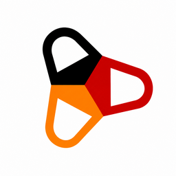
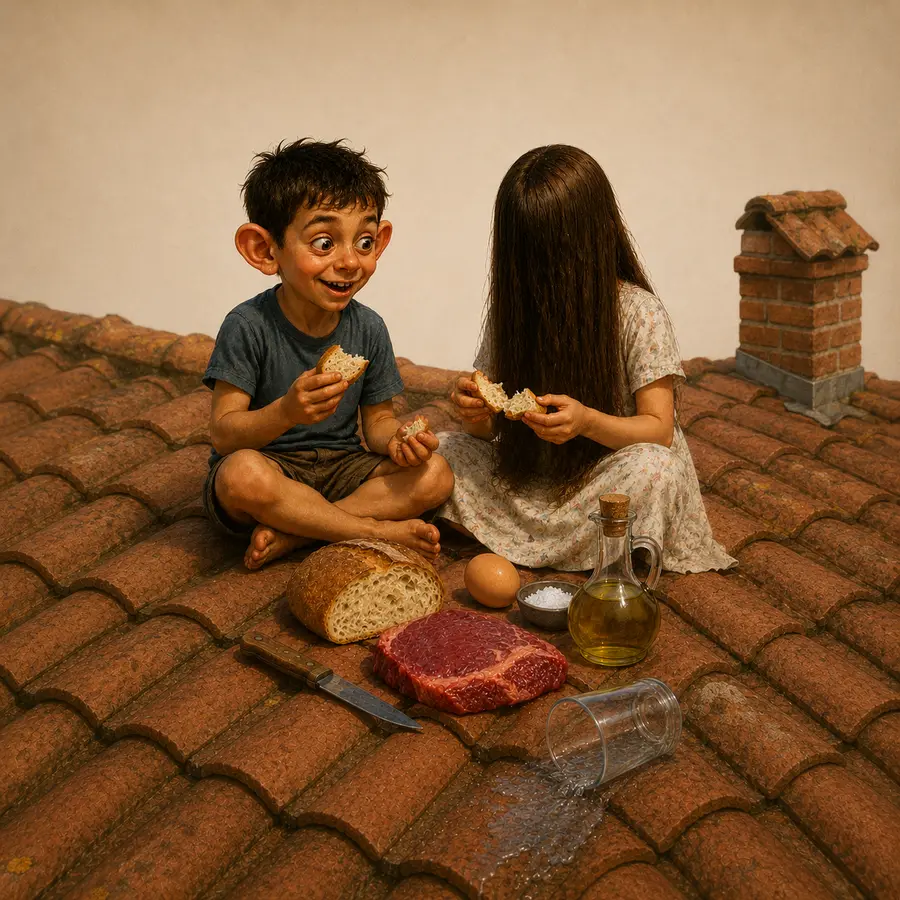

<div align="center">



# Der · Die · Das Explorer

**A friendly app for mastering the one thing every German learner dreads — grammatical gender.**

[🚀 **Open the live app**](https://der-die-das-explorer.lovable.app/)

</div>

---

## Why this exists

German nouns are *der*, *die* or *das*, and the article rarely follows from meaning alone. Most learners memorise gender one painful word at a time. **Der Die Das Explorer** flips that around: it surfaces the *patterns* (endings, themes, compound rules), pairs them with vivid visual stories, and then drills them — so gender starts to feel like something you can reason about rather than just recall.

It's a small, fast, phone-first web app. No login, no setup — just open it and learn.

## What's inside

The app is organised into five tabs:

| Tab | What it does |
| --- | --- |
| 📖 **Rules** | The pattern engine — **Themes** (meaning groups like days/seasons → *der*), **Compounds** (the gender follows the last word), and **Endings** (e.g. *-ung*, *-heit*, *-keit* → *die*), laid out as an interactive, colour-coded bubble cloud. |
| 🎨 **Scenes** | ~22 illustrated **memory scenes** — short bilingual mini-stories where every noun shares a gender, so the article sticks through imagery and narrative. Swipe through them. |
| 🎭 **Special** | The notorious edge cases — words that flip meaning with their article (*der/das Teil*, *der/die/das …*) and other traps. |
| 🎯 **Practice** | Flashcards and a timed Speed Round drawn from a **5,300+ noun** pool, split into **A1–A2** and **B1–B2** CEFR levels. |
| 📊 **Progress** | Tracks how you're doing as you practise. |

<div align="center">
<table>
  <tr>
    <td></td>
    <td></td>
    <td></td>
  </tr>
  <tr align="center">
    <td><em>das · Frühstück auf dem Dach</em></td>
    <td><em>der · Die Rettung im Wald</em></td>
    <td><em>die · An der Ampel</em></td>
  </tr>
</table>
<sub>A few of the memory scenes — each one packs a single gender into one image so the article comes back with the picture.</sub>
</div>

## How it was built — a vibe-coding project

This app is a **vibe-coding** experiment: built conversationally, by describing what I wanted in plain language and letting AI tools do the heavy lifting — design, code, and content — while I steered, reviewed, and tuned. No part of it started from a traditional spec or a hand-written boilerplate.

Three tools, three jobs:

- 🧠 **[Claude Code](https://claude.com/claude-code)** — reasoning, data pipeline, and code. Claude curated and classified the gender rules, built the leveled practice-word lists, wrote the deterministic layout engine for the Endings bubble cloud, and handled the iterative refactors and Git workflow. Larger changes were planned and tracked with **[OpenSpec](https://github.com/Fission-AI/OpenSpec)** inside Claude Code — proposing a spec, generating the design/tasks, then implementing and archiving it — so each feature had a written intent before any code was written.
- 🎨 **ChatGPT (DALL·E / image generation)** — every memory-scene illustration was generated as a square image, one per scene, each composed around a single grammatical gender.
- 🛠️ **[Lovable](https://lovable.dev/)** — the app shell, UI, and hosting. Lovable scaffolded the TanStack Start + React frontend and deploys it straight from this repo.

The interesting bit is the **division of labour**: Lovable owns the *app*, Claude owns the *thinking and the data*, and ChatGPT owns the *art*. They meet in this repository — Claude generates structured data (`src/data/*`) and layout logic (`src/lib/*`), the images live in `public/scenes/`, and Lovable renders it all.

## Where the data comes from

- **Gender rules** (`src/data/rules.json`, `compound_heads.json`) — a curated set of theme groups, ending patterns, and compound-head rules, each annotated with how reliable it is (suffix vs. broader pattern vs. marginal) and *why* the rule holds.
- **Practice nouns** (`src/data/practiceWords.ts`) — ~5,300 nouns assembled from a hybrid of **CEFR vocabulary (Goethe-style A1–B2 lists)** and **word-frequency data**, filtered to keep genuinely useful words and split into A1–A2 and B1–B2 tiers. English glosses were machine-translated and cached.
- **Memory scenes** (`src/data/scenes.ts`) — hand-authored bilingual micro-stories, each paired with a generated illustration.

## Tech stack

- **[TanStack Start](https://tanstack.com/start)** (SSR) + **React** + **TypeScript**
- **Tailwind CSS** + **Radix UI** primitives
- **Framer Motion** for animation, gestures (swipe), and draggable popups
- **Vite** build · **Bun** package manager · deployed via **Lovable** (Cloudflare)

The Endings layout is a pure, **deterministic** circular bubble-packer (no `Math.random()` — SSR-safe to avoid hydration mismatches) with its own geometry test in `scripts/verify-ending-layout.ts`.

## Running locally

```bash
bun install
bun run dev      # start the dev server
bun run build    # production build
```

> The repo uses Bun (`bun.lock`). `src/routeTree.gen.ts` is auto-generated — don't hand-edit it.

## Project layout

```
src/
  components/ddd/   # the five tab views + shared UI
  data/             # rules.json, practiceWords.ts, scenes.ts, compound_heads.json
  lib/              # endingLayout.ts — the deterministic bubble packer
  routes/           # TanStack routes
public/
  scenes/           # 22 generated memory-scene images
  logo-icon.png     # app logo / favicon
scripts/
  verify-ending-layout.ts   # geometry test for the Endings circle
```

---

<div align="center">
<sub>Built with curiosity and a lot of conversation. Viel Erfolg beim Lernen! 🇩🇪</sub>
</div>
